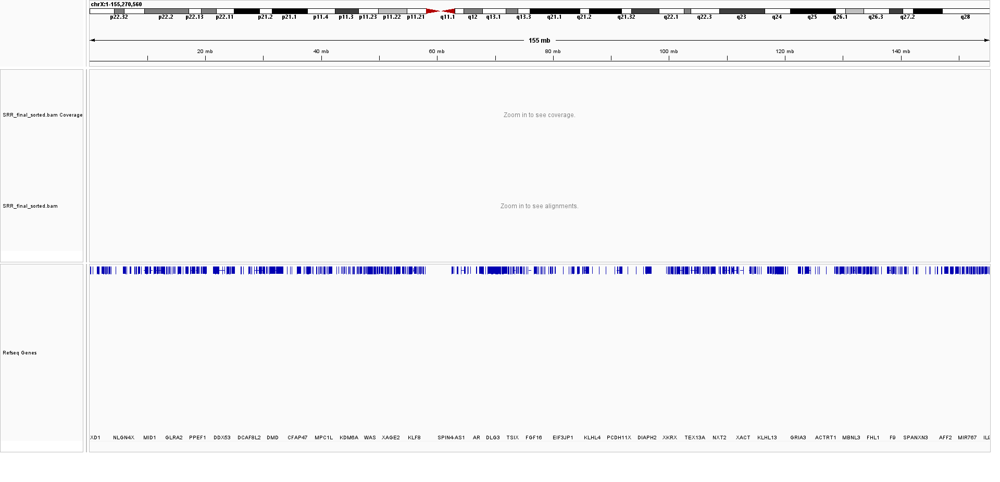
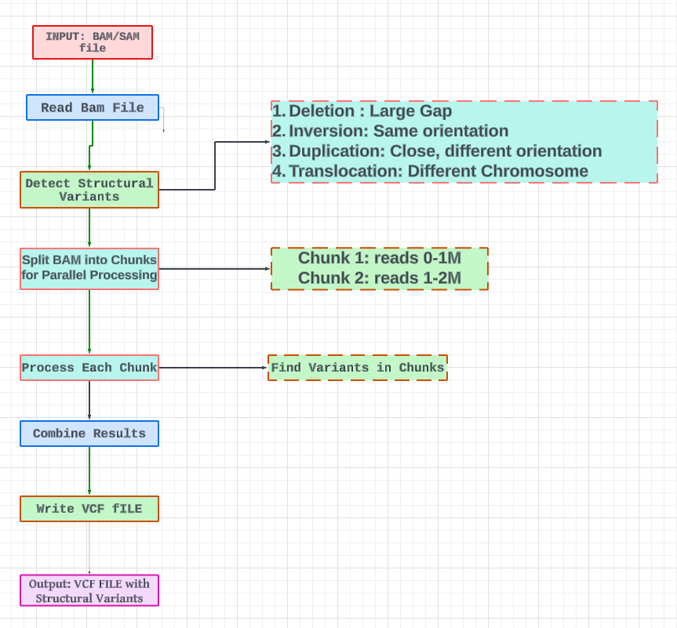
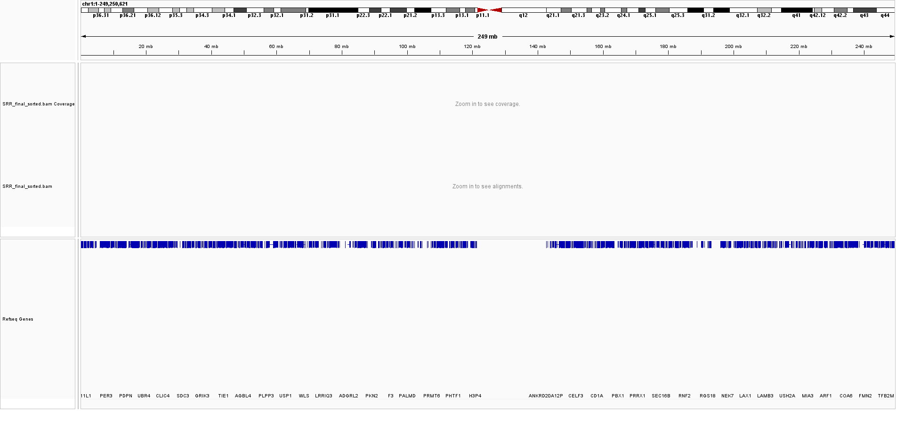
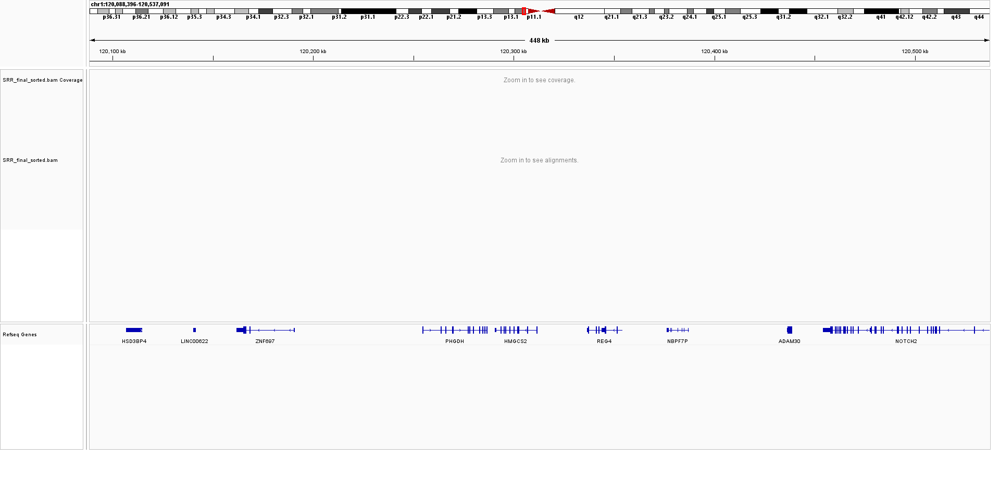
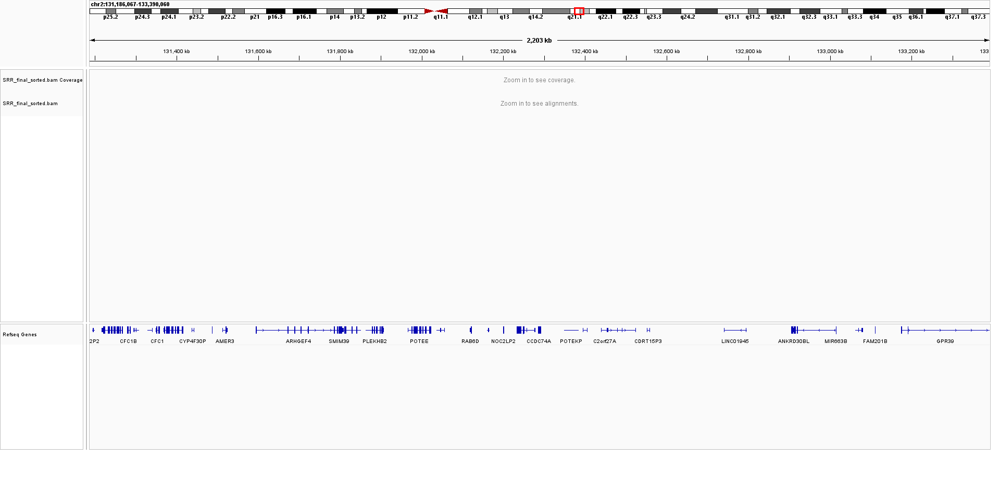
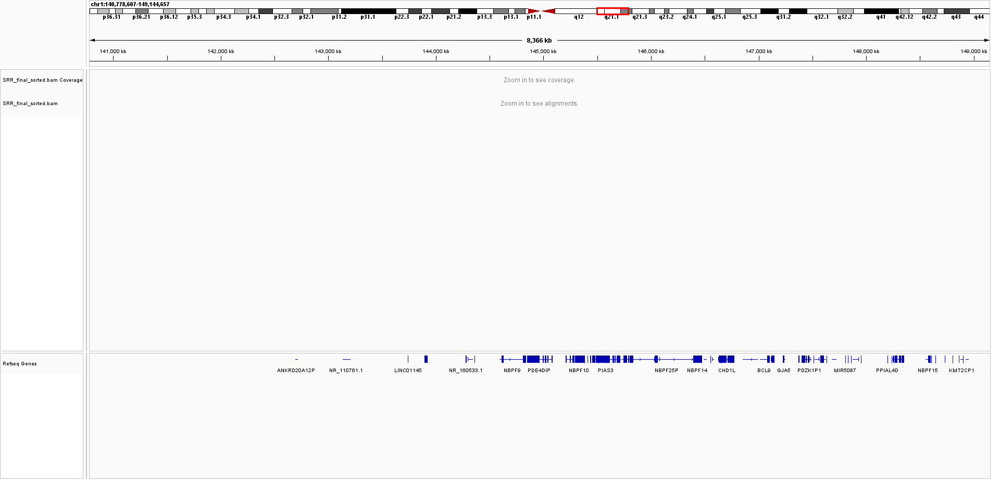

# Structural Variant Detection in BAM Files

This project involves the detection of structural variants in SAM/BAM files using Python. Structural variants include deletions, inversions, duplications, and translocations. The detected variants are outputted in VCF format, a standard format for storing gene sequence variations.

## Table of Contents

- [Introduction](#introduction)
- [Requirements](#requirements)
- [Installation](#installation)
- [Usage](#usage)
- [Project Workflow](#project-workflow)
- [Examples](#examples)
- [Contributing](#contributing)
- [License](#license)

## Introduction

Structural variants are large-scale changes in the genome, such as deletions, duplications, inversions, and translocations. Detecting these variants is crucial for understanding genetic diversity and disease mechanisms. This project provides a Python script to analyze BAM files, detect structural variants, and output them in VCF format.

## Requirements

- Python 3.7+
- `pysam` library
- `pandas` library (for potential future use)
- `concurrent.futures` (part of Python standard library)

## Installation

1. Clone the repository:
   ```bash
   git clone https://github.com/PM-0125/structural-variant-detection.git
   cd structural-variant-detection
   ```

2. Create a virtual environment and activate it:
   ```bash
   python -m venv venv
   source venv/bin/activate  # On Windows, use `venv\Scripts\activate`
   ```

3. Install the required libraries:
   ```bash
   pip install pysam pandas
   ```

## Usage

1. Ensure your BAM file is sorted and indexed. If not, sort and index it using `samtools`:
   ```bash
   samtools sort -o sorted_input.bam input.bam
   samtools index sorted_input.bam
   ```

2. Run the script:
   ```bash
   python detect_structural_variants.py
   ```

3. The output will be a VCF file (`output.vcf`) containing the detected structural variants.

## Project Workflow

The project follows these main steps:

1. **Reading BAM File**: The BAM file is read using the `pysam` library.
2. **Detecting Structural Variants**: Structural variants are detected by analyzing paired reads.
3. **Splitting BAM File into Chunks**: For large BAM files, the file is split into smaller chunks for parallel processing.
4. **Parallel Processing**: Each chunk is processed in parallel to speed up the variant detection.
5. **Writing VCF File**: The detected variants are formatted and written to a VCF file.

## Examples

### Input BAM File



### Workflow Diagram



### Sample Output

Here is an example of what the VCF output might look like:

```
##fileformat=VCFv4.2
#CHROM  POS     ID      REF     ALT             QUAL    FILTER  INFO
1       10000   .       N       <DEL:1500>      .       PASS    SVTYPE=DEL;END=11500;SVLEN=-1500
1       20000   .       N       <INV:500>       .       PASS    SVTYPE=INV;END=20500;SVLEN=500
2       30000   .       N       <DUP:300>       .       PASS    SVTYPE=DUP;END=30300;SVLEN=300
1       40000   .       N       <TRA>           .       PASS    SVTYPE=TRA;CHR2=2;POS2=50000
```

### Visualization of Variants

#### Deletions



#### Inversions



#### Duplications



#### Translocations



## Contributing

Contributions are welcome! Please open an issue or submit a pull request for any improvements or bug fixes.

## License

This project is licensed under the MIT License - see the [LICENSE](LICENSE) file for details.

---

### How to Add Visualizations

1. **BAM File Structure**: Use a generic image showing the structure of BAM files. Tools like [SAMtools](http://www.htslib.org/) can generate visual representations.

2. **Workflow Diagram**: Create a flowchart using tools like [Lucidchart](https://www.lucidchart.com/), [draw.io](https://app.diagrams.net/), or any diagram software to illustrate the steps of the workflow.

structural-variant-detection/
├── images/
│   ├── bam_file_structure.png
│   ├── workflow_diagram.png
│   ├── deletion_example.png
│   ├── inversion_example.png
│   ├── duplication_example.png
│   └── translocation_example.png
├── data/
│   ├── input.bam
│   ├── input.bam.bai
│   └── output.vcf
├── detect_structural_variants.py
├── README.md
└── LICENSE


3. **Variant Examples**: Use genome browsers like [IGV](http://software.broadinstitute.org/software/igv/) to visualize structural variants. You can take screenshots of the different types of variants (deletions, inversions, duplications, translocations) as they appear in the browser.

